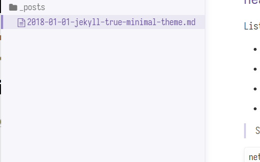
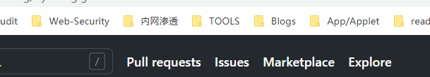

True minimal theme is extremely lightweight and ascetic jekyll theme.

This theme has only one css file, which is used for source code highlighting. 


# Heading 1
## Heading 2
### Heading 3

List of entries:

- item 1
- item 2
- item 3
- item 4

> Source code are highlighted:

```bash
net group "domain computers" /domain
```

| tset       | test2     | t323t      |
| ---------- | --------- | ---------- |
| qwdd2o3j23 | tset      | test2      |
| tset       | test2     | t323ttset  |
| tset       | test2tset | t323ttest2 |



